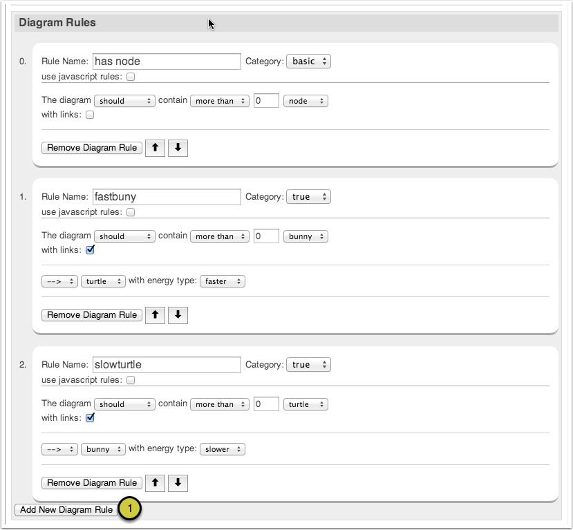
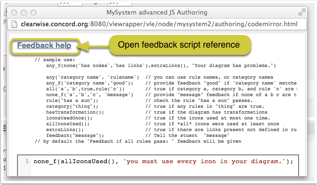
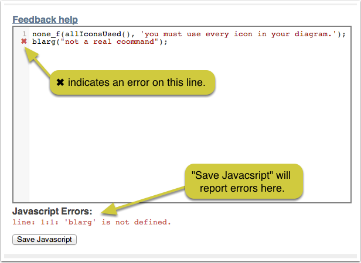

# MySystem Rubric & Feedback Authoring # 

### Overview  ###

This document assumes that the reader is already familiar with how to add Nodes and Links to their MySystem activity.  

As an author wanting to give automatic feedback and scores to students, you will need to do the following:

1. Make the diagram Nodes and Links (not covered here).
1. [Create rubric categories][categories] for scoring and feedback.
1. Define [simple rules][simple_rules] which belong to one or more categories.
1. Create the [rubric rules][rubric].
1. Specify [diagram feedback rules][feedback].
1. Optionally make more [complex diagram rules][jsrules] .
1. Review the [language reference][ref] when lost.

### Create Categories [categories] ###

Categories can be used in the scoring of diagrams, and/or to provide automatic feedback. Originally categories were thought of as a way to expressing evidence of various levels of knowledge integration. More generally they are also useful as a set of 'OR'ed diagram rules. Any diagram rule can be tagged with a 'category'.  When one or more rules belonging to a category evaluate to 'true', the category itself is expressed as 'true'. Editing categories is simple, you just provide a name.

### Simple Diagram Rules [simple_rules] ###

The Diagram rules are displayed in a list view section.

 

 

1. To add a new rule, Click on the "Add New Diagram Rule" button (1)
2. Give the rule a title.  You can use this name to identify this rule later in the rubric or feedback sections.
3. Optionally choose a category for the rule.
4. Specify the rule constrants.
5. You can remove a rule by using the "Remove Diagram Rule" button.
6. Use the arrow buttons to move this rule up or down in the list. (Note: the order of the rules doesn't matter in most cases.)

### Simplified Javascript Editor [simplified_editor] ###
Diagram scoring, Diagram feedback, and custom Diagram rules are all defined by editing simplified Javascript.  When an author clicks on the "edit" button associated with feedback, rubric, or composite rules, an external editor window is opened.

The editor has a help section that displays example scripts, and pre-defined functions.

When the author clicks "save" within the editor window, the script is syntax checked using jshint. If problems are found, they are displayed in red text, with a red ✖ in the script gutter, indicating the line on which the problem is suspected to be on.

If the 'save' button brings up errors, it won't save the javascript immediately.  An author can force a save, even if there are errors by closing the window, but you are encouraged to work through the errors. Its easier to find typos and errors, if you keep your javascript clean.

Each 'mode' for the editor has its own set of pre-defined functions, and help content.  

Some functions work almost everywhere.

#### Common Simplified Javascript functions [common_js] ####

`all(true,true,true);        // true`
: True if all arguments evaluate as true

`any(true,false,false);      // true`
: True if any argument evaluates to true

`none(false,false,true);     // false` 
: True if no arguments evaluate to true;

`not_any(false,false,false); // true`
: True only if all arguments are false.

`not_all(false,false,true);  // true`
: true if any argument is false'

`rule('rulename');`
: Evaluates the rule "rulename" returning true or false`.

`category('a');`
: Evaluates all the rules tagged with category 'a'. If any matching rules evaluate to true, the result of this method is true.

`hasTransformation();`
: True if any node has an energy type output, that doesn't have a corresponding energy-type input.

`iconsUsedOnce();`
: True if there are no duplicate icons on the screen. (only one of anything)

`allIconsUsed();`
: True if every icon in the pallet wsa used.

`extraLinks();`
: True if there are links on the diagram that haven't been defined in rules.`

------

### Rubric Evaluator [rubric] ###

In the authoring envioronment there is a 'Rubric Evaluator' section. From here you can edit rubric rules, or score the preview diagram using the current rubric.

You can test your rubric by clicking on the 'Score the diagram' button.  This will bring up an alert box displaying the current score, the rubric categories the diagram belongs in, and the time stamp for the score. This mimics the format the data will be saved in when the student submits their work. 

The rubric is edited in a [simplified editor][simplified_editor] window.

Rubric is evaluated top to bottom.  The **first** "score producing" statement becomes the score for the diagram. The default (un-scored) *score* will always be -1. Specify a score by calling `score(3);` where 3 is the final score.  

All batch functions (`any`,`all`,`none`, &etc.) have a scoring equivalent. eg: `all_s('a', 'b', 'c', 3);` would score 3 for the diagram if categories 'a', 'b', & 'c' are all present.

Many Rubric specific functions end in "**s**" for __score__.

#### Rubric specific javascipt functions  ####

(see: [common js][common_js] for other javascript which can be used here.)

`score(10); //score 10`
: Score the diagram. Can be, for example in an if block.` 

`any_s('a','b', 3);  //score 3`
: If any() is true, then score as last argument (numeric). In the example above, if 'a' or 'b' is true, then the shall be 3.

`none_s, all_s, not_any_s (etc)`
: These are the scoring variants of none, all, any &etc. The last argument should be a number indicating the score to be given if the conditions are met.

------

### Feedback   [feedback] ###

In the authoring envioronment there is a 'Feedback' section. From here you can view or edit the feedback rules, adjust the size of the feedback dialog box, or specify the default feedback for the diagram Or score the preview diagram using the current rubric.

To test the feedback, you need to click on the "Submit Diagram" button in the preview window.

When you click the "edit" button in the 'Feedback' section, the [simplified editor][simplified_editor] window is opened with the feedback rules.

Feedback is evaluated top to bottom.  The first "feedback producing" statement becomes the feedback for the diagram. The default feedback if no feedback is generated by the script, will be the feedback specified in the panel as "Feedback if all rules pass".  The default value is "Your diagram has no obvious problems."

Whereas the Rubric specific functions tended to end in 's', the feedback section supports variants ending in "f" for __feedback__. 

#### Feedback specific functions  ####

(see: [common js][common_js] for other javascript which can be used here.)

`dontCount();`
:feedback commands after this are not counted against the student submission counter. This remains in effect until a `count();` command.

`count();`
:re-enable counting feedback against the student submission counter. By default the counter is on. It must be disabled with a `dontCount();` command.

`feedback('your drawing is awesome');`
: Set feedback explicitly. This call would be made in some other conditional.

`any_f('a','b', "awesome!");`
: If any() is true, then provide the last argument as feedback (String). In the example above, if 'a' or 'b' is true, then the shall be "awesome".

none_f, all_f, not_any_f, &etc. are more feedback variants.
: These are the feedback variants of none, all, any &etc. The last argument should be a string which will be presented as the feedback if the conditions are met.

------

### Javascript Diagram Rules [jsrules] ###

In most cases, an author should only need to create rules using the authoring GUI.  In some rare cases it makes sense to have a named javascript rule. A typical case for defining a javascript rule is when two or more connection types are equivilent. Giving a name to a javascript rule allows the rule to be reused in the rubric rules, and the scoring rules. 

By checking the "use javascript rules" check box, a rule can evaluate a limited set of javascript.  This can be handy when making 'composite' rules, which summarize the behavior of several other simple rules. 

All javascript rules should explicitly set the result property somewhere.  i.e.

    result = true;

If your rule doesn't produce output, it will __probably__ evaluate to false, but its a mistake not to set the result explicitly somewhere.

There is a danger of having a rule evaluate itself and recursing. Let's say we are defining a javascript rule named 'composite'.   This would be a bad rule:

    result = all('a','b',any('composite'));

The evaluation system attempts to look for simple recursing javascript rules, and will evaluate such as 'false'. But don't tempt fate! a recursing rule could cause your browser window to lock up. You could loose work.

*** 

## Full Simplified Javascript Rule Reference [ref]##

`all(true,true,true);        // true`
: True if all arguments evaluate as true

`any(true,false,false);      // true`
: True if any argument evaluates to true

`none(false,false,true);     // false` 
: True if no arguments evaluate to true;

`not_any(false,false,false); // true`
: True only if all arguments are false.

`not_all(false,false,true);  // true`
: true if any argument is false'

`rule('rulename');`
: Evaluates the rule "rulename" returning true or false`.

`category('a');`
: Evaluates all the rules tagged with category 'a'. If any matching rules evaluate to true, the result of this method is true.

`hasTransformation();`
: True if any node has an energy type output, that doesn't have a corresponding energy-type input.

`iconsUsedOnce();`
: True if there are no duplicate icons on the screen. (only one of anything)

`allIconsUsed();`
: True if every icon in the pallet wsa used.

`extraLinks();`
: True if there are links on the diagram that haven't been defined in rules.`

**Rubric specific:**

`score(10); //score 10`
: Score the diagram. Can be, for example in an if block.` 

`any_s('a','b', 3);  //score 3`
: If any() is true, then score as last argument (numeric). In the example above, if 'a' or 'b' is true, then the shall be 3.

`none_s, all_s, not_any_s (etc)`
: These are the scoring variants of none, all, any &etc. The last argument should be a number indicating the score to be given if the conditions are met.

**Feedback specific:**

`dontCount();`
:feedback commands after this are not counted against the student submission counter. This remains in effect until a `count();` command.

`count();`
:re-enable counting feedback against the student submission counter. By default the counter is on. It must be disabled with a `dontCount();` command.

`feedback('your drawing is awesome');`
: Set feedback explicitly. This call would be made in some other conditional.

`any_f('a','b', "awesome!");`
: If any() is true, then provide the last argument as feedback (String). In the example above, if 'a' or 'b' is true, then the shall be "awesome".

none_f, all_f, not_any_f, &etc. are more feedback variants.
: These are the feedback variants of none, all, any &etc. The last argument should be a string which will be presented as the feedback if the conditions are met.

**Custom Rules**

`result=true;`
: All custom js rules should explicitly set the result property somewhere using this expression.

 